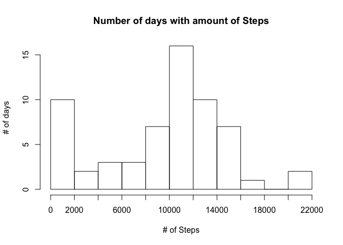
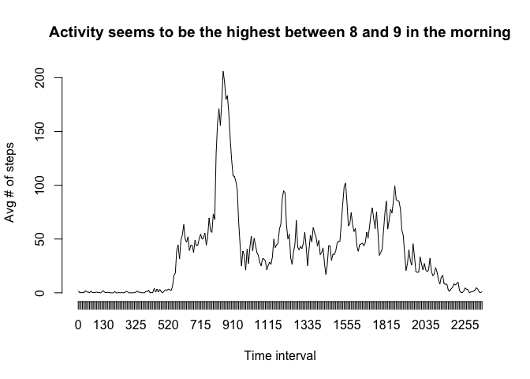
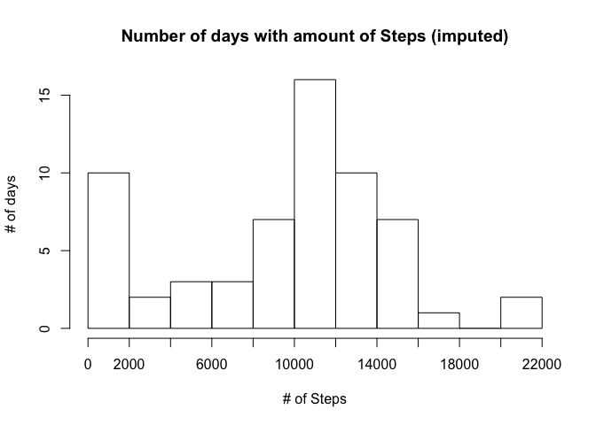

# Reproducible Research: Peer Assessment 1

## Loading and preprocessing the data
Unzip and load data and do necessary/helpful transformations.

```r
unzip("activity.zip")
activity <- read.csv("activity.csv")
activity$weekday <- c("Sunday", "Monday", "Tuesday", "Wednesday", "Thursday", "Friday", "Saturday")[as.POSIXlt(as.Date(activity$date))$wday + 1]
```

## What is mean total number of steps taken per day?
Calculate steps per day

```r
stepsPerDay <- tapply(activity$steps, activity$date, sum, na.rm = T)
b <- seq(0, 22000, length.out = 12)
hist(stepsPerDay, breaks = b, main = "Number of days with amount of Steps", ylab = "# of days", xlab = "# of Steps", axes = F)
axis(2)
axis(1, at = b, labels = b)
```

<!-- -->


Overall, the mean of steps per day was 9354, while the median of steps per day is 1.0395\times 10^{4}

## What is the average daily activity pattern?
Combine all days to intervalls, regardless of weeksday

```r
t <- tapply(activity$steps, activity$interval, mean, na.rm = T)
plot(t, type = "l", main = "Activity seems to be the highest between 8 and 9 in the morning", ylab = "Avg # of steps", xlab = "Time interval", axes = F)
axis(2)
axis(1, at = 1:length(t), labels = names(t))
```

<!-- -->

## Imputing missing values
Try to impute missing values with meaningful values. Therefore we will consider both interval and weekday, as I assume weekday has an significant impact on the activity (we will see later in the next part of the exercise). Missing values will be filled by the median of all other matching weekday + intervall.

```r
quantile(activity$steps, na.rm = T, probs = seq(0,1,0.1))
```

```
##   0%  10%  20%  30%  40%  50%  60%  70%  80%  90% 100% 
##    0    0    0    0    0    0    0    0   28   86  806
```

```r
activity2 <- activity
activity2$f <- paste(activity2$weekday, activity2$interval)
activity2$steps[is.na(activity2$steps)] <- ave(activity2$steps, activity2$f, FUN = function(x) median(x, na.rm = T))[c(which(is.na(activity2$steps)))]
activity2$f <- NULL
quantile(activity2$steps, probs = seq(0,1,0.1))
```

```
##   0%  10%  20%  30%  40%  50%  60%  70%  80%  90% 100% 
##    0    0    0    0    0    0    0    0   25   74  806
```
As seen, imputing values did slightly change the quantiles

## Are there differences in activity patterns between weekdays and weekends?

```r
library(ggplot2)
weekdayyes <- activity2$weekday %in% c("Monday", "Tuesday", "Wednesday", "Thursday", "Friday")
activity2$weekday2 <- ""
activity2$weekday2[weekdayyes] <- "weekday"
activity2$weekday2[!weekdayyes] <- "weekend"
activity2$weekday2 <- as.factor(activity2$weekday2)
temp <- aggregate(steps ~ interval + weekday2, data = activity2, mean)
ggplot(temp, aes(interval, steps)) + geom_line() + facet_grid(weekday2 ~ .) + xlab("Interval (5 min)") + ylab("# of steps") + ggtitle("Differences in number of steps in weekdays/weekends")
```

<!-- -->


